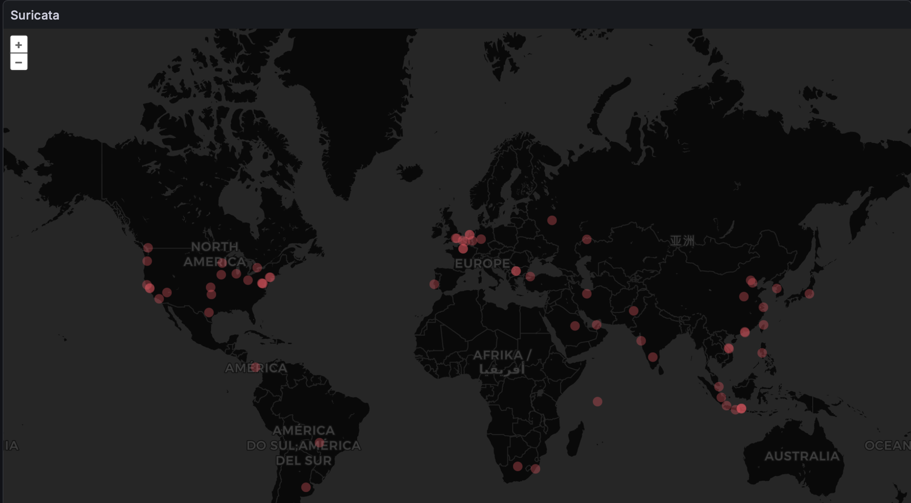

## Introduction

One of the things I like about running my own network security stack is being able to see where attacks are coming from. In this setup, I use Suricata to detect malicious activity, MikroTik to automatically block offending hosts, Prometheus to collect metrics, and Grafana Geomap to visualize blocked IP addresses on a world map.

The result is a live map showing the geographic locations of hosts that have been blocked by Suricata.



## **Architecture Overview**

The workflow is relatively simple:

1. Suricata detects suspicious traffic.
2. Offending IP addresses are added to a MikroTik firewall address list named Suricata.
3. A Linux helper server periodically retrieves the address list from MikroTik.
4. The server performs GeoIP lookups using the MaxMind GeoLite2 database.
5. A lightweight Python exporter exposes the data in Prometheus format.
6. Prometheus scrapes the exporter.
7. Grafana Geomap displays the blocked hosts on a world map.

```
Suricata
    ↓
MikroTik Address List
    ↓
Helper Server
    ↓
GeoIP Lookup
    ↓
Python Exporter
    ↓
Prometheus
    ↓
Grafana Geomap
```

## **Collecting Blocked IP Addresses**

Every 10 minutes a cron job executes two scripts

```bash
/opt/ips/get.sh
/opt/ips/convert.sh
```

The first script connects to the MikroTik router and exports all dynamically blocked addresses from the Suricata  address list.

```bash
root@exporter:/opt/ips# cat get.sh 
rm /opt/ips/lista.txt
sshpass -f /opt/ips/pass.txt ssh admin@10.33.22.1 ':foreach i in=[/ip firewall address-list find where list="Suricata" and dynamic=yes] do={ :put [/ip firewall address-list get $i address] }' > /opt/ips/lista.txt
```

The second script uses the MaxMind GeoLite2 City database to determine the latitude and longitude of each IP address.

```bash
root@exporter:/opt/ips# cat convert.sh 
rm /opt/ips/lista_clean.txt
rm /opt/ips/wspolrzedne.txt
tr -d '\r' < /opt/ips/lista.txt > /opt/ips/lista_clean.txt
while read -r ip; do
  lat=$(mmdblookup --file /usr/share/GeoIP/GeoLite2-City.mmdb --ip "$ip" location latitude | grep -oE '[0-9.-]+')
  lon=$(mmdblookup --file /usr/share/GeoIP/GeoLite2-City.mmdb --ip "$ip" location longitude | grep -oE '[0-9.-]+')
  echo "$ip $lat $lon"
done < /opt/ips/lista_clean.txt > /opt/ips/wspolrzedne.txt
```

The resulting file contains entries like:

```bash
root@exporter:/opt/ips# head wspolrzedne.txt 
64.23.161.101 37.393100 -121.962000
64.62.156.47 44.976400 -93.224000
45.91.64.7 55.738600 37.606800
152.32.180.86 25.073400 55.297900
41.162.56.37 -29.855300 31.042800
64.62.197.63 37.751000 -97.822000
47.236.167.82 1.366700 103.800000
45.221.96.7 -29.000000 24.000000
188.119.38.82 41.048700 28.971600
34.145.187.23 38.894000 -77.036500
```

## **Exposing Metrics to Prometheus**

A small Python HTTP server reads the generated file and exposes three Prometheus metrics:

```bash
mikrotik_ips_geo
mikrotik_ips_geo_lat
mikrotik_ips_geo_lon
```

The exporter runs as a systemd service:

```bash
root@exporter:/opt/ips# cat /etc/systemd/system/mikrotik-geo-exporter.service 
[Unit]
Description=MikroTik GeoIP Prometheus Exporter
After=network.target

[Service]
Type=simple
ExecStart=/usr/bin/python3 /opt/ips/exporter.py
WorkingDirectory=/opt/ips

Restart=always
RestartSec=5

NoNewPrivileges=true
PrivateTmp=true

[Install]
WantedBy=multi-user.target
```

This is code:

```python
root@exporter:/opt/ips# cat exporter.py
from http.server import BaseHTTPRequestHandler, HTTPServer
FILE = "/opt/ips/wspolrzedne.txt"
PORT = 8087
def load_metrics():
    metrics = []
    try:
        with open(FILE, "r") as f:
            for line in f:
                line = line.strip()
                if not line:
                    continue
                parts = line.split()
                if len(parts) != 3:
                    continue
                ip, lat, lon = parts
                try:
                    lat_f = float(lat)
                    lon_f = float(lon)
                except:
                    continue
                metrics.append(f'mikrotik_ips_geo{{ip="{ip}"}} 1')
                metrics.append(f'mikrotik_ips_geo_lat{{ip="{ip}"}} {lat_f}')
                metrics.append(f'mikrotik_ips_geo_lon{{ip="{ip}"}} {lon_f}')
    except Exception as e:
        metrics.append(f'# error {e}')
    return "\n".join(metrics) + "\n"

class Handler(BaseHTTPRequestHandler):
    def do_GET(self):
        if self.path != "/metrics":
            self.send_response(404)
            self.end_headers()
            return
        data = load_metrics()
        self.send_response(200)
        self.send_header("Content-Type", "text/plain; version=0.0.4")
        self.end_headers()
        self.wfile.write(data.encode())
if __name__ == "__main__":
    print(f"Exporter running on :{PORT}")
    server = HTTPServer(("0.0.0.0", PORT), Handler)
    server.serve_forever()
```

Prometheus then scrapes the exporter endpoint:

```bash
scrape_configs:
  - job_name: mikrotik_geo
    static_configs:
      - targets:
          - exporter:8087
```

This is sample output:

```bash
root@exporter:/opt/ips# curl http://10.33.22.127:8087/metrics
mikrotik_ips_geo{ip="64.23.161.101"} 1
mikrotik_ips_geo_lat{ip="64.23.161.101"} 37.3931
mikrotik_ips_geo_lon{ip="64.23.161.101"} -121.962
mikrotik_ips_geo{ip="64.62.156.47"} 1
mikrotik_ips_geo_lat{ip="64.62.156.47"} 44.9764
mikrotik_ips_geo_lon{ip="64.62.156.47"} -93.224
mikrotik_ips_geo{ip="45.91.64.7"} 1
mikrotik_ips_geo_lat{ip="45.91.64.7"} 55.7386
mikrotik_ips_geo_lon{ip="45.91.64.7"} 37.6068
```

## **Grafana Geomap Configuration**

The Geomap panel uses three Prometheus queries:

```pgsql
mikrotik_ips_geo

mikrotik_ips_geo_lat

mikrotik_ips_geo_lon
```

Grafana transformations are used to:

* Convert labels into fields.
* Join datasets by the `ip` label.
* Rename fields to `lat` and `lon`.

The marker layer is configured to use:

```
Latitude  -> lat

Longitude -> lon
```

Each blocked IP is then displayed as a marker on the world map.

And this is JSON Panel for Grafana:

```json
{
  "id": 14,
  "type": "geomap",
  "title": "Suricata",
  "gridPos": {
    "x": 0,
    "y": 0,
    "h": 23,
    "w": 23
  },
  "fieldConfig": {
    "defaults": {
      "custom": {
        "hideFrom": {
          "tooltip": false,
          "viz": false,
          "legend": false
        }
      },
      "mappings": [],
      "thresholds": {
        "mode": "absolute",
        "steps": [
          {
            "color": "green",
            "value": null
          },
          {
            "color": "red",
            "value": 80
          }
        ]
      },
      "color": {
        "mode": "thresholds"
      }
    },
    "overrides": []
  },
  "transformations": [
    {
      "id": "labelsToFields",
      "options": {}
    },
    {
      "id": "joinByField",
      "options": {
        "byField": "ip",
        "mode": "outer"
      }
    },
    {
      "id": "organize",
      "options": {
        "excludeByName": {},
        "includeByName": {},
        "indexByName": {},
        "renameByName": {
          "Value #A": "lat",
          "Value #B": "lon",
          "Value #C": "wartosc",
          "ip": "ip"
        }
      }
    }
  ],
  "pluginVersion": "12.3.1",
  "targets": [
    {
      "editorMode": "code",
      "exemplar": false,
      "expr": "mikrotik_ips_geo",
      "format": "table",
      "instant": true,
      "legendFormat": "__auto",
      "range": false,
      "refId": "A"
    },
    {
      "datasource": {
        "type": "prometheus",
        "uid": "bf8o9f8via3uof"
      },
      "editorMode": "code",
      "exemplar": false,
      "expr": "mikrotik_ips_geo_lat",
      "format": "table",
      "hide": false,
      "instant": true,
      "legendFormat": "__auto",
      "range": false,
      "refId": "B"
    },
    {
      "datasource": {
        "type": "prometheus",
        "uid": "bf8o9f8via3uof"
      },
      "editorMode": "code",
      "exemplar": false,
      "expr": "mikrotik_ips_geo_lon",
      "format": "table",
      "hide": false,
      "instant": true,
      "legendFormat": "__auto",
      "range": false,
      "refId": "C"
    }
  ],
  "datasource": {
    "type": "prometheus",
    "uid": "bf8o9f8via3uof"
  },
  "options": {
    "view": {
      "allLayers": true,
      "id": "zero",
      "lat": 0,
      "lon": 0,
      "noRepeat": false,
      "zoom": 1
    },
    "controls": {
      "showZoom": true,
      "mouseWheelZoom": true,
      "showAttribution": true,
      "showScale": false,
      "showMeasure": false,
      "showDebug": false
    },
    "tooltip": {
      "mode": "details"
    },
    "basemap": {
      "config": {},
      "name": "Layer 0",
      "noRepeat": false,
      "type": "default"
    },
    "layers": [
      {
        "config": {
          "showLegend": true,
          "style": {
            "color": {
              "fixed": "red"
            },
            "opacity": 0.6,
            "rotation": {
              "fixed": 0,
              "max": 360,
              "min": -360,
              "mode": "mod"
            },
            "size": {
              "fixed": 5,
              "max": 15,
              "min": 2
            },
            "symbol": {
              "fixed": "img/icons/marker/circle.svg",
              "mode": "fixed"
            },
            "symbolAlign": {
              "horizontal": "center",
              "vertical": "center"
            },
            "textConfig": {
              "fontSize": 12,
              "offsetX": 0,
              "offsetY": 0,
              "textAlign": "center",
              "textBaseline": "middle"
            }
          }
        },
        "filterData": {
          "id": "byRefId",
          "options": "joinByField-A-B-C"
        },
        "location": {
          "latitude": "Value #B",
          "longitude": "Value #C",
          "mode": "coords"
        },
        "name": "Layer 1",
        "tooltip": true,
        "type": "markers"
      }
    ]
  }
}
```

## **Why I Built This**

The primary goal was not advanced threat intelligence but visibility.

Instead of looking at a list of blocked IP addresses, I can instantly see:

* Geographic concentration of attacks.
* Countries generating the most alerts.
* Large scanning campaigns.
* Distribution of malicious traffic over time.

It’s also a great example of how a few simple scripts can connect Suricata, MikroTik, Prometheus, and Grafana into a useful visualization platform.

## **Final Thoughts**

This solution is intentionally lightweight. No databases, no complex integrations, and no commercial software. Just:

* Suricata
* MikroTik
* MaxMind GeoLite2
* Python
* Prometheus
* Grafana

Together they provide a real-time global view of hosts that have been automatically blocked by my network security stack.
